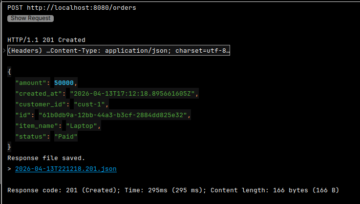
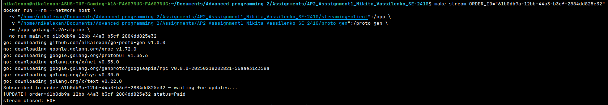

# AP2 Assignment 3 - Event-Driven Architecture (Order, Payment & Notification Microservices)

**Student:** Nikita Vassilenko, SE-2410

---

## What changed in Assignment 2

| # | Change |
|---|--------|
| 1 | Order→Payment communication migrated from **HTTP REST** to **gRPC** |
| 2 | Payment Service exposes a **gRPC server** (`ProcessPayment` RPC) |
| 3 | Order Service exposes a **gRPC server** (`SubscribeToOrderUpdates` — server-side streaming) |
| 4 | **Unary interceptor** on Payment Service logs method name + duration |
| 5 | Proto files live in a dedicated GitHub repo; generated `.pb.go` files are produced by GitHub Actions CI |

### Proto & Generated Code Repos
- **Protos** (`.proto` files): https://github.com/NikAlexan/go-protos
- **Generated** (`.pb.go` files): https://github.com/NikAlexan/go-proto-gen

---

## Architecture

```
┌──────────────────────────────────────────────────────────────────┐
│                     Client (curl / Postman)                      │
└─────────────────────────────┬────────────────────────────────────┘
                              │ HTTP REST
                              ▼
┌─────────────────────────────────────────────────────────────────────┐
│                  Order Service  :8080 (HTTP) | :50052 (gRPC)        │
│                                                                     │
│  transport/http  ← Gin REST handlers (external API, unchanged)      │
│  transport/grpc  ← OrderServiceServer: SubscribeToOrderUpdates()    │
│       │                          │                                  │
│  OrderUseCase               PaymentGRPCClient                       │
│       │                          │ gRPC (ProcessPayment)            │
│  PostgresOrderRepo               ▼                                  │
└───────┬──────────────────────────────────────────────────────────┘  │
        │                  ┌───────────────────────────────────────┐  │
  ┌──────────┐             │  Payment Service  :8081 (HTTP) | :50051 (gRPC) │
  │ orders_db│             │                                       │
  │(Postgres)│             │  transport/grpc ← PaymentServiceServer│
  └──────────┘             │    + LoggingInterceptor (bonus)       │
                           │  transport/http ← kept for reference  │
                           │  PaymentUseCase (unchanged)           │
                           │  PostgresPaymentRepo                  │
                           └───────────────┬───────────────────────┘
                                           │
                                     ┌─────────────┐
                                     │ payments_db │
                                     │  (Postgres) │
                                     └─────────────┘
```

---

## gRPC Services

### PaymentService (`payment/payment.proto`)
| RPC | Type | Description |
|-----|------|-------------|
| `ProcessPayment` | Unary | Authorizes a payment; returns `Authorized`/`Declined` + transaction ID |

### OrderService (`order/order.proto`)
| RPC | Type | Description |
|-----|------|-------------|
| `SubscribeToOrderUpdates` | Server-side streaming | Streams status changes for an order until terminal state |

---

## Ports

| Service | HTTP | gRPC |
|---------|------|------|
| Order Service | 8080 | 50052 |
| Payment Service | 8081 | 50051 |

---

## How to Run

**Prerequisites:** Docker & Docker Compose.

```bash
cp .env.example .env
make run
```

---

## API Examples

### Create order (Paid — payment authorized over gRPC)

```bash
curl -X POST http://localhost:8080/orders \
  -H "Content-Type: application/json" \
  -d '{"customer_id":"cust-1","item_name":"Laptop","amount":50000}'
```

### Create order (Failed — amount > $1000 → Declined)

```bash
curl -X POST http://localhost:8080/orders \
  -H "Content-Type: application/json" \
  -d '{"customer_id":"cust-1","item_name":"Server","amount":150000}'
```

### Get order

```bash
curl http://localhost:8080/orders/<order-id>
```

### Cancel order

```bash
curl -X PATCH http://localhost:8080/orders/<order-id>/cancel
```

### Subscribe to order status stream (gRPC)

```bash
# In one terminal — subscribe
cd streaming-client
go run main.go <order-id>

# In another terminal — trigger a state change
curl -X PATCH http://localhost:8080/orders/<order-id>/cancel
```

---

## Clean Architecture Layers (per service)

```
internal/
├── domain/          <- Pure Go structs + domain errors. No framework deps.
├── usecase/         <- Business logic. Depends on interfaces only.
├── repository/      <- Implements ports. Talks to PostgreSQL / gRPC.
├── transport/http/  <- Gin handlers (external REST API).
└── transport/grpc/  <- gRPC server + interceptor.
cmd/<service>/main.go <- Composition Root. Manual DI, no magic.
```

---

## Business Rules

| Rule | Detail |
|------|--------|
| Amount type | `int64` (cents). Float64 is forbidden for money. |
| Amount > 0 | Validated in Order use case. |
| Payment limit | Amount > 100 000 cents ($1000) → `Declined`. |
| Cancel rule | Only `Pending` orders can be cancelled. |
| gRPC timeout | Order Service uses `context.WithTimeout(2s)` when calling Payment Service. |

---

## Evidences

### gRPC call — POST /orders → Payment authorized via gRPC (status: Paid)


### Server-side streaming — SubscribeToOrderUpdates


---

## Bonus: gRPC Interceptor

Payment Service has a unary server interceptor that logs every RPC call:

```
[gRPC] method=/payment.PaymentService/ProcessPayment duration=1.92ms err=<nil>
```

---

## Assignment 3: Event-Driven Architecture

### What changed

| # | Change |
|---|--------|
| 1 | Payment Service publishes a `PaymentEvent` to RabbitMQ after every successful payment |
| 2 | New **Notification Service** consumes events and logs a simulated email |
| 3 | **Manual ACKs** — message is acknowledged only after successful processing |
| 4 | **Durable queues** — messages survive a broker restart |
| 5 | **Idempotency** — duplicate events are silently skipped using an in-memory seen-ID store |
| 6 | **Dead Letter Queue (DLQ)** — messages that fail 3 times are routed to `payment.completed.dlq` |
| 7 | **Graceful Shutdown** — both Payment and Notification services use `os/signal` |

### Updated Architecture

```
┌─────────────────────────────────────────────────────────────────────┐
│                     Client (curl / Postman)                         │
└──────────────────────────────┬──────────────────────────────────────┘
                               │ HTTP REST
                               ▼
┌──────────────────────────────────────────────────────────────────┐
│               Order Service  :8080 (HTTP) | :50052 (gRPC)        │
└──────────────────────────────┬───────────────────────────────────┘
                               │ gRPC (ProcessPayment)
                               ▼
┌──────────────────────────────────────────────────────────────────┐
│             Payment Service  :8081 (HTTP) | :50051 (gRPC)        │
│                         ↓ after DB save                          │
│               publish JSON event to RabbitMQ                     │
└──────────────────────────────┬───────────────────────────────────┘
                               │ AMQP — queue: payment.completed
                               ▼
                    ┌─────────────────────┐
                    │      RabbitMQ       │
                    │  (durable queue)    │
                    └──────────┬──────────┘
                               │
               ┌───────────────┴───────────────────┐
               ▼                                   ▼
  ┌─────────────────────────┐       ┌──────────────────────────┐
  │  Notification Service   │       │  DLQ: payment.completed  │
  │  logs simulated email   │       │  .dlq  (after 3 retries) │
  └─────────────────────────┘       └──────────────────────────┘
```

### Idempotency Strategy

Each published event carries a unique `event_id` (UUID generated at publish time).
The Notification Service maintains a `sync.RWMutex`-protected `map[string]bool` in memory.
Before processing, it checks `store.Seen(event.EventID)`. If the ID was already processed, the
message is ACKed immediately without printing the notification log. After successful processing,
`store.Mark(event.EventID)` is called to record the ID.

> Trade-off: the in-memory store is reset on service restart, so duplicates across restarts
> will be re-processed. For production use, replace with a Redis SET or a DB-backed seen-IDs table.

### ACK Logic

- `autoAck` is disabled on the consumer channel.
- Happy path: message processed → `msg.Ack(false)`.
- Duplicate: event already seen → `msg.Ack(false)` (consume without logging).
- Transient failure (< 3 retries): `msg.Nack(false, true)` — requeue for retry.
- Permanent failure (≥ 3 retries): `msg.Nack(false, false)` — no requeue, RabbitMQ routes to DLQ.

### RabbitMQ Management UI

Available at `http://localhost:15672` (guest / guest) when running via Docker Compose.

### Ports

| Service | HTTP | gRPC | Notes |
|---------|------|------|-------|
| Order Service | 8080 | 50052 | |
| Payment Service | 8081 | 50051 | |
| RabbitMQ | — | — | AMQP: 5672, UI: 15672 |